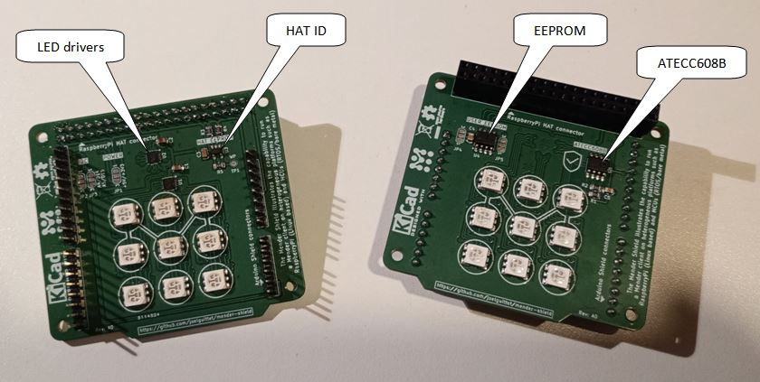

# mender-shield

The Mender Shield illustrates the capability to run a Mender client on heterogeneous platforms such as RaspberryPi (Linux based) and MCUs (RTOS/bare metal).

The following picture shows the Mender devices in the field with the mender-shield on the front, RaspberryPi and ESP32 platforms in the back:
- The Mender logo is displayed on the front of the shield, with an animation of the purple LEDs when an artifact is being downloaded.
- The background color indicates the connectivity status (blue is connected, green is idle, red in case of error).

The following picture shows both sides of the mender-shield:
- The RaspberryPi side has KTD2061 and KTD2058 LEDs drivers from [Kinetic technologies](https://www.kinet-ic.com/ktd2061) driving the 18 RGB LEDs (9 for each side of the PCB) and the [HAT ID EEPROM](https://datasheets.raspberrypi.com/hat/hat-plus-specification.pdf).
- The Arduino side has [ATECC608B](https://www.microchip.com/en-us/product/atecc608b) secure element used to authenticate the device and user EEPROM intented to store [Zephyr LLEXT](https://docs.zephyrproject.org/latest/services/llext/index.html) binary so that the shield also embeds the firmware used to control the display!

[Mender MCU client](https://github.com/joelguittet/mender-mcu-client) is an open source over-the-air (OTA) library updater for MCU devices. Check-out the source and demonstration examples!

## Hardware

The project has been created with [Kicad](https://www.kicad.org/), you can browse the project on [KiCanvas](https://kicanvas.org/?github=https%3A%2F%2Fgithub.com%2Fjoelguittet%2Fmender-shield%2Ftree%2Fmaster%2Fhardware). Gerber files used to manufacture the board are provided.

## Software

The software is not uploaded at the time of writing.

## License

Copyright joelguittet and mender-mcu-client contributors

Licensed under the Apache License, Version 2.0 (the "License");
you may not use this file except in compliance with the License.
You may obtain a copy of the License at

    http://www.apache.org/licenses/LICENSE-2.0

Unless required by applicable law or agreed to in writing, software
distributed under the License is distributed on an "AS IS" BASIS,
WITHOUT WARRANTIES OR CONDITIONS OF ANY KIND, either express or implied.
See the License for the specific language governing permissions and
limitations under the License.
